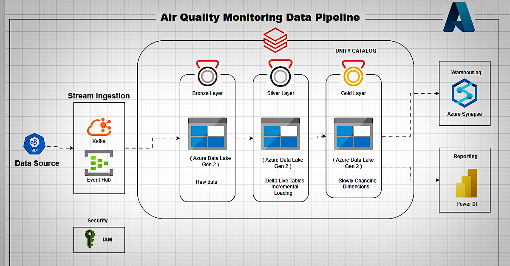
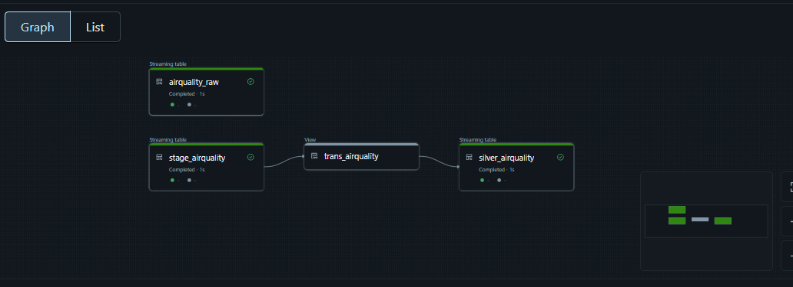
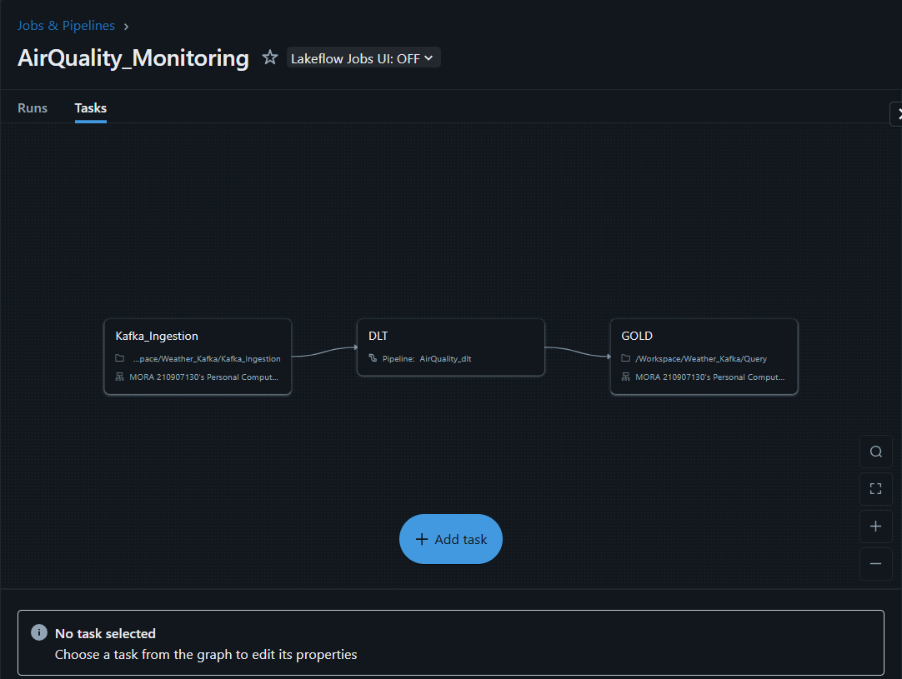
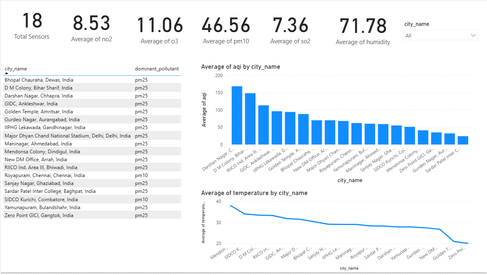

# 🌍 Real-Time Air Quality Monitoring – End-to-End Streaming Data Pipeline

A fully automated, real-time air quality monitoring system built with modern data engineering tools and scalable architecture. It captures pollution data via APIs, processes it in real time using Databricks, and presents insights through Power BI dashboards — all with governance and historical tracking in place.

---

## 🧠 Problem Statement

Air pollution is a major health concern worldwide. Many monitoring systems are either delayed or lack the ability to track changes over time. This project solves that gap with a fully orchestrated real-time data pipeline that supports streaming, automation, and historical tracking.

---

## 🏗️ Architecture Overview

This pipeline follows the **Medallion Architecture** (Bronze → Silver → Gold) and integrates cloud-native tools across ingestion, processing, governance, and visualization.

  

### 🔁 Data Flow:
API → Kafka → Azure Event Hub → Databricks (DLT) → Delta Lake → Azure Synapse → Power BI

- **Bronze Layer**: Raw ingestion from Event Hub  
- **Silver Layer**: Cleaned, schema-aligned data  
- **Gold Layer**: Historical SCD Type 2 tracked data  

---

## ⚙️ Tech Stack

| Layer               | Tools Used                             |
|---------------------|-----------------------------------------|
| Ingestion           | REST APIs, Kafka, Azure Event Hub       |
| Processing          | Databricks, Delta Live Tables (DLT)     |
| Data Storage        | Azure Data Lake Gen2 (Delta Format)     |
| Historical Tracking | SCD Type 2 (Custom Logic in Gold Layer) |
| Governance          | Unity Catalog, IAM                      |
| Data Warehouse      | Azure Synapse Analytics                 |
| BI & Visualization  | Power BI                                |

---

## 🛠️ Delta Live Tables Pipeline

The backbone of this pipeline is built using **Delta Live Tables**, enabling real-time ingestion, transformation, and orchestration with monitoring.

  

## Orchestration 

  

✅ Key Benefits:
- Auto-manages streaming + batch data  
- Simplifies ETL with declarative pipelines  
- Built-in error handling & data quality checks

---

## 📊 Power BI Dashboard

Power BI is used to present live insights on pollution metrics, dominant pollutants, and city-wise trends.

  

### Dashboard Features:
- Live AQI values by city  
- Pollution category breakdown (PM2.5, PM10, CO, NO₂, SO₂)  
- Trend over time  
- Real-time refresh from Azure Synapse

